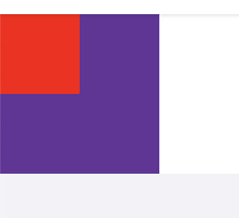
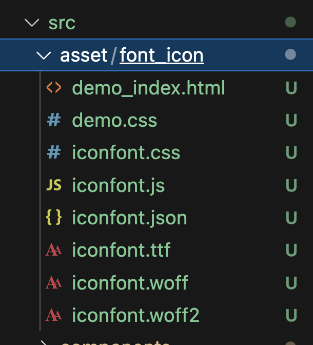
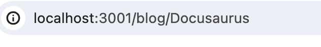
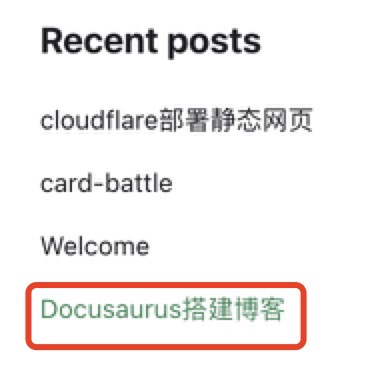
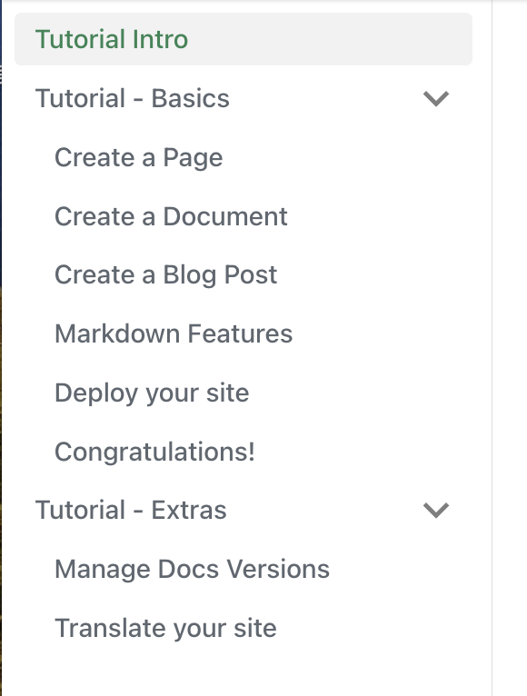
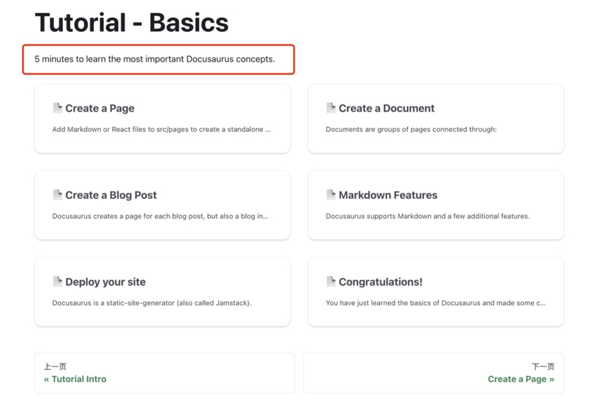

<!--truncate-->

# 使用 Docusaurus 创建一个个人博客网站

## 参考

Docusaurus 官方文档：https://docusaurus.io/zh-CN/docs

大佬的笔记：https://kuizuo.cn/docs/docusaurus-guides

fork 大佬的项目：https://github.com/ppnnssy/blog

## 搭建过程

### 1.创建初始模版

`npx create-docusaurus@latest websiteName classic`

### 2.配置文件

docusaurus.config.ts

sidebar.js

具体配置参考官方文档吧

### 3. 引入 Scss

因为后续打算使用 module.css 写样式，所以引入了 Scss
参考：https://docusaurus.io/zh-CN/docs/next/styling-layout#sassscss

1.下载 scss 插件：
`npm install --save docusaurus-plugin-sass sass`

2.在 docusaurus.config.js 文件中包含这个插件,并把 @docusaurus/preset-classic 的 customCss 属性设置成你的 Sass/SCSS 文件：

```
export default {
  // ...
  plugins: ['docusaurus-plugin-sass'],
  // ...
  presets: [
    [
      '@docusaurus/preset-classic',
      {
        // ...
        theme: {
          customCss: ['./src/css/custom.scss'],
        },
        // ...
      },
    ],
  ],
};
```

然后就可以正常使用 sass 了。
可以把 src/css/custom.css 改成 scss 文件

举例如下
Test.jsx：

```
import React from "react";
import styles from "./Test.module.scss";

function Test() {
  return (
    <div className={styles.son}>
      <div className={styles.son2}></div>
    </div>
  );
}

export default Test;
```

Test.module.scss:

```
.son {
  width: 100px;
  height: 100px;
  background-color: rebeccapurple;
  .son2 {
    width: 50px;
    height: 50px;
    background-color: red;
  }
}

```

呈现效果：


### 4. 引入 Tailwind CSS

因为后续主页是用 AI 生成的，需要用到 Tailwind，所以先引入一下，过程参考了：
https://cloud.tencent.com/developer/article/2357237

1.安装
`npm install tailwindcss postcss autoprefixer`

2.在项目根目录创建一个 tailwind.config.js 文件并进行配置：

```
// tailwind.config.js
module.exports = {
  content: [
    "./src/**/*.{js,ts,jsx,tsx}",
    "./public/index.html",
  ],
  theme: {},
  plugins: [],
};
```

3.在项目根目录创建一个 postcss.config.js 文件：

```
// postcss.config.js
module.exports = {
  plugins: {
    tailwindcss: {},
    autoprefixer: {},
  },
};
```

4.在样式中导入 Tailwind CSS
打开 src/custom.scss，添加内容

```
@import "tailwindcss/base";
@import "tailwindcss/components";
@import "tailwindcss/utilities";
```

然后就可以正常使用 Tailwind 类了

### 5.引入阿里巴巴矢量图标

下载图标过程就不说了
下载好，新建 src/asset 文件夹，把图标文件放进去


导入图标 css 文件：

`import "../asset/font_icon/iconfont.css";`

使用图标

`<span className="iconfont icon-icon_zuoyoujiantou icon"></span>`

icon 类是自己定义的，可以在这里面控制 span 的样式和图标的大小

### 6.导入静态资源文件（图片和 svg）

普通的这样的行不通，需要用 Docusaurus 自己固定的导入方法，记录如下：

1.导入普通图片：
导入

`import lygithub from "@site/static/img/lygithub.jpeg";`

或者可以在静态资源目录中建立 index.js 文件，统一导出图片

```
import lygithub from "./lygithub.jpeg";
export { lygithub };
```

使用的时候方便导入

`import { lygithub } from "../../static/img/index";`

使用:

``

2.使用 svg 比较特殊，所有导入的 svg 都会自动变成组件
导入：

`import MbgPic from "@site/static/img/mbgPic.svg";`

此时 MbgPic 就是个组件，直接当组件使用就可以：

```
   <MbgPic
    width="600"
    style={{
      aspectRatio: "600/338",
      objectFit: "cover",
    }}
    className="object-cover"
    height="338"
   ></MbgPic>
```

## docs 和 blog 的开头写法

先说 blog。首先有个 authors.yml 文件，文件中保存了作者信息。这里先添加上我自己

```

ppnnssy:
name: ppnnssy
title: Nobody
url: https://github.com/ppnnssy
image_url: https://github.com/ppnnssy.png

```

然后写博客的时候，.md 文件开头是这样的

```

---

slug: Docusaurus
title: Docusaurus 搭建博客
authors: [ppnnssy]
tags: [Docusaurus, 静态网站, blog]

---

```

下面解释四个的含义：

slug：本博客的 id，也就是本博客页面的路由。例如本博客路由如下



title：博客标题，会显示在侧边导航栏



authors：就是作者了，作者具体信息在 authors.yml 中

tags：本文章的标签，会显示在 blog 页的最下方


然后是 docs

docs 文件夹列表一般是这个样子：

```

.
├── intro.md
├── tutorial-basics
│ ├── _category_.json
│ ├── congratulations.md
│ ├── create-a-blog-post.md
│ ├── create-a-document.md
│ ├── create-a-page.md
│ ├── deploy-your-site.md
│ └── markdown-features.mdx
└── tutorial-extras
├── _category_.json
├── img
│ ├── docsVersionDropdown.png
│ └── localeDropdown.png
├── manage-docs-versions.md
└── translate-your-site.md

```

显示到页面上，文件夹和文件夹对应侧边导航栏



文件夹的顺序可以通过内部的 \_category\_.json 文件调整

```

{
"label": "Tutorial - Basics",
"position": 2,
"link": {
"type": "generated-index",
"description": "5 minutes to learn the most important Docusaurus concepts."
}
}

```

label：侧边栏上显示的文件夹名

position：文件夹在总列表中的顺序

description：点击文件夹显示的页面上的描述



文件夹内部的.md 文档同样在文件上使用 position 表示文档顺序

```

---

## sidebar_position: 6

---

```
