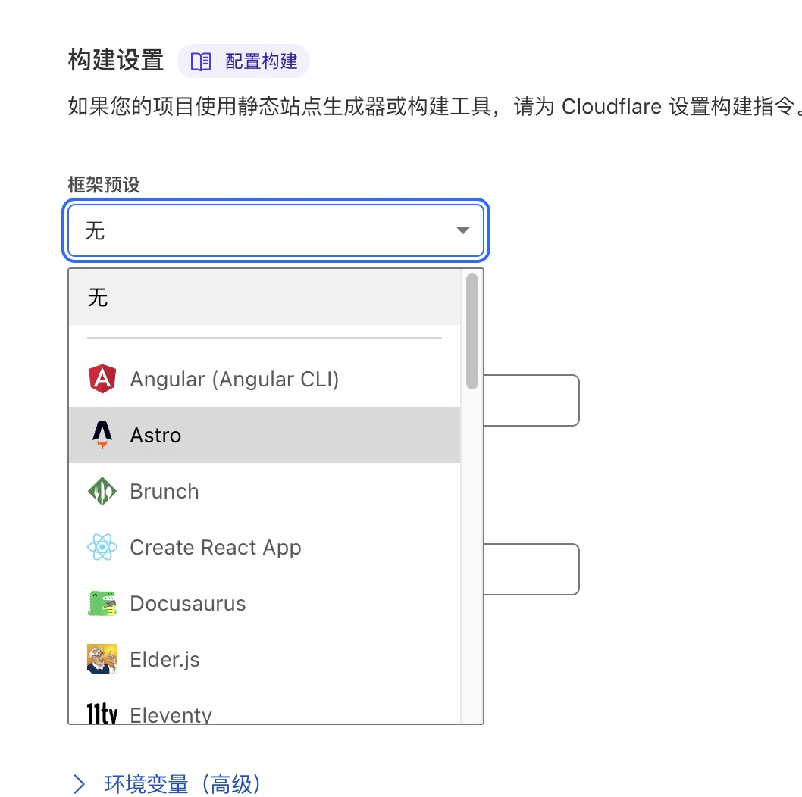

<!--truncate-->

## 项目起因和介绍

使用 Docusaurus 做了一个静态网站，用来写博客。需要找个免费的静态网页部署服务（因为抠门不想花钱）。对比 github pages 和 cloudflare pages，决定使用 cloudflare。原因如下：
1.github 需要写配置文件，研究了半天没看懂怎么写（我笨）。cloudflare 只需要点点点就行了
2.github 只能选择 root 或者./docs 文件夹做为根目录，而 Docusaurus 要使用 docs 文件夹保存文档，冲突了

## 部署过程

### 1.项目上传 github

cloudflare 可以和 github 仓库关联。

### 2.建立 pages 项目

地址：https://dash.cloudflare.com/
注册登录之后来到 Workers 和 Pages 页面==>创建应用程序==>切换到 pages==>连接到 git==>开始设置
这里要注意，因为项目是 react 项目，所以要选择框架预设

这里选 Create React App,默认命令就是 npm run build

### 3.生成静态网页

域名是项目名+随机字符。
我的：https://myblogs-e31.pages.dev/

### 4.网站更新

push 推动的更新。也就是 github 项目每次 push，都会自动重新构建网站
