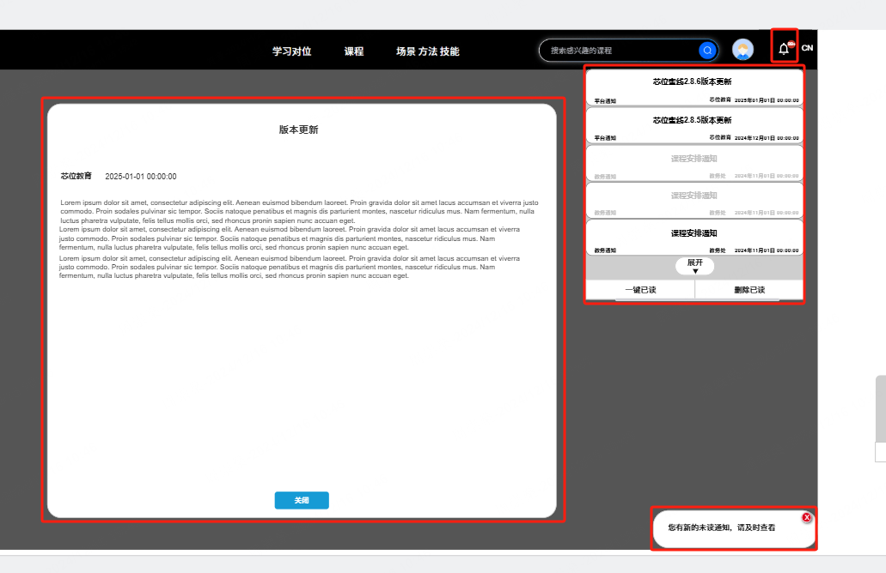

### 起因
密线项目做消息通知的时候有一个需求，消息列表展开后，点击红色框之外的区域关闭列表，红框之内的区域不关闭列表。明显这是一个排除法，需要判断点击的元素是否在某几个确定的元素内。element-plus有一个指令clickOutside，但是只能判断一个元素，项目中需要判断多个元素，所以自己写了一个指令。
<!-- truncate -->


### 思路
给每个红框加一个属性，然后在document上监听click事件，判断点击的元素是否在红框内。

```
<template>
  <el-popover
    :width="300"
    :teleported="true"
    trigger="click"
    placement="bottom-start"
    :show-arrow="false"
    :visible="showNoticePopover"
    class="noticePopover"
  >
    <!-- 无未读消息 -->
    <div class="emptyList" sign="noticepopover">
      <div class="item">123</div>
      <div class="item">123</div>
      <div class="item">123</div>
      <div class="item">123</div>
      <div class="item">123</div>
      <div
        class="item"
        @click="showMessageBox"
        sign="noticepopover"
        v-for="i in 5"
      >
        {{ i * 111111 }}
      </div>
    </div>

    <template #reference>
      <div sign="noticepopover" @click="changeStatus">点我</div>
    </template>
  </el-popover>

  <div
    v-show="messageVisible"
    class="messageDialog"
    sign="noticepopover"
    @click="messageVisible = false"
  >
    这是一条信息
  </div>

  <div class="tip" @click="showNoticePopover = true" sign="noticepopover">
    Tip
  </div>
</template>

<script setup>
import { ref, onMounted, onBeforeUnmount } from "vue";
const showNoticePopover = ref(false);

onMounted(() => {
  document.addEventListener("click", eventHandler);
});
onBeforeUnmount(() => {
  document.removeEventListener("click", eventHandler);
});
function eventHandler(e) {
  // 获取所有父节点
  let par = e.target;
  for (;;) {
    // 循环到页面最顶层还没有发现noticepopover
    if (!par) {
      closePopover()
      break;
    }
    if (par?.attributes?.sign?.value == "noticepopover") {

      break;
    }
    par = par.parentNode;
  }
}
// 自定义指令参数，点击外部区域的处理函数，如关闭弹窗
const closePopover = () => {
  showNoticePopover.value = false;
};

const changeStatus = () => {
  showNoticePopover.value = !showNoticePopover.value;
};

const messageVisible = ref(false);

const showMessageBox = () => {
  messageVisible.value = true;
};
</script>

<style scoped lang="less">
.tip {
  width: 100px;
  height: 30px;
  position: fixed;
  bottom: 10px;
  right: 10px;
  border: solid 1px #ccc;
}
.messageDialog {
  width: 100px;
  height: 100px;
  position: fixed;
  bottom: 40vh;
  left: 40vw;
  border: #ccc solid 1px;
}
</style>
```

这里当时毕竟难的地方在于，如何判断点击的元素是否在某个元素内。
现在的做法是，通过获取点击的元素的父节点，一层一层的往上找，直到找到noticepopover这个属性为止。
如果找到顶层都没有找到noticepopover，则说明点击的元素不在红框内。

如果只有单层的话其实不用这么麻烦，直接使用自定义指令，判断一下点击的元素是否等于绑定的元素就好了

## 优化
后来发现可以用element.contains()方法，判断点击的元素是否在某个元素内。
于是函数改为：
```
function eventHandler(e) {
  // // 获取所有父节点
  // let par = e.target;
  // for (;;) {
  //   // 循环到页面最顶层还没有发现noticepopover
  //   if (!par) {
  //     closePopover();
  //     break;
  //   }
  //   if (par?.attributes?.sign?.value == "noticepopover") {
  //     break;
  //   }
  //   par = par.parentNode;
  // }
  const elements= document.querySelectorAll("div[sign='noticepopover']");
  for(let ele of elements){
    if(ele.contains(e.target)){
      return
    }
  }
  showNoticePopover.value = false;

}
```