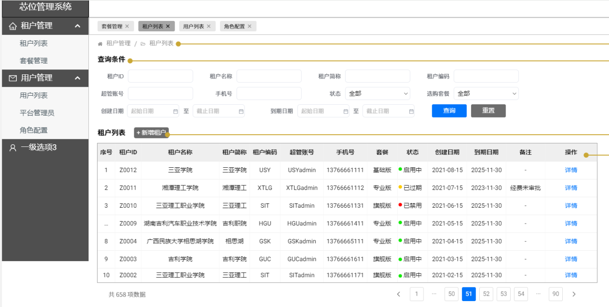
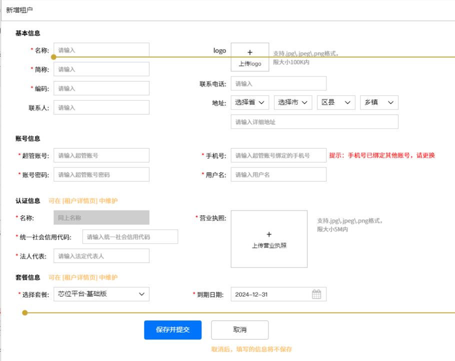
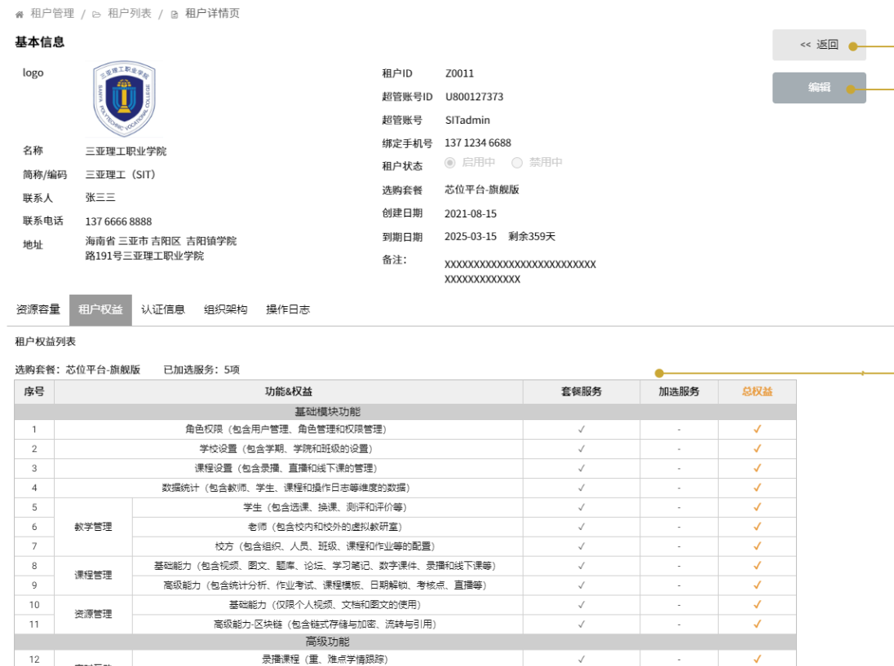
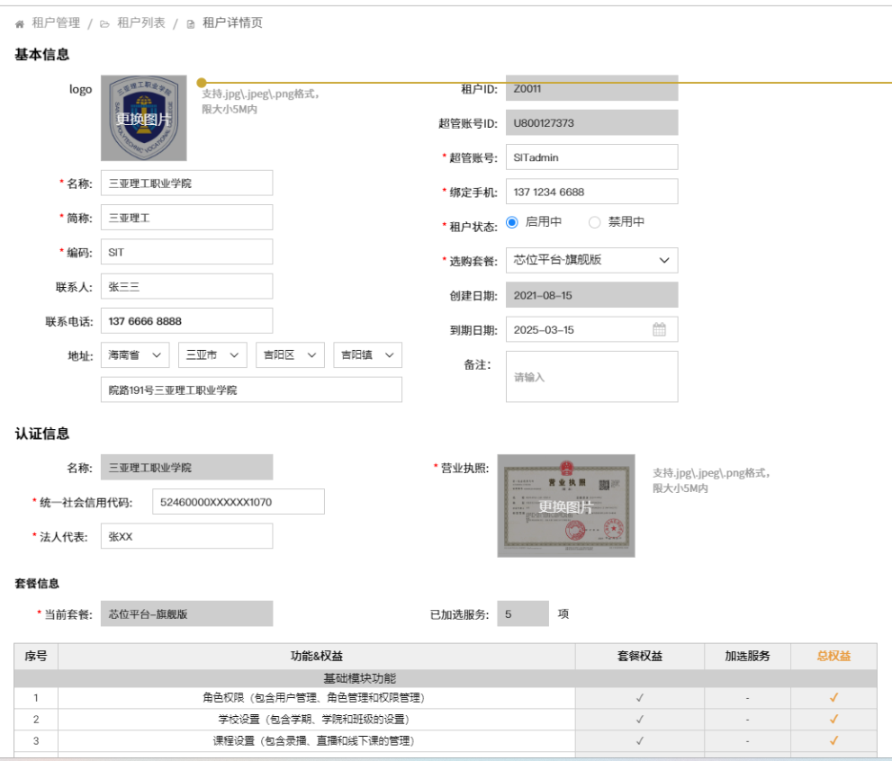
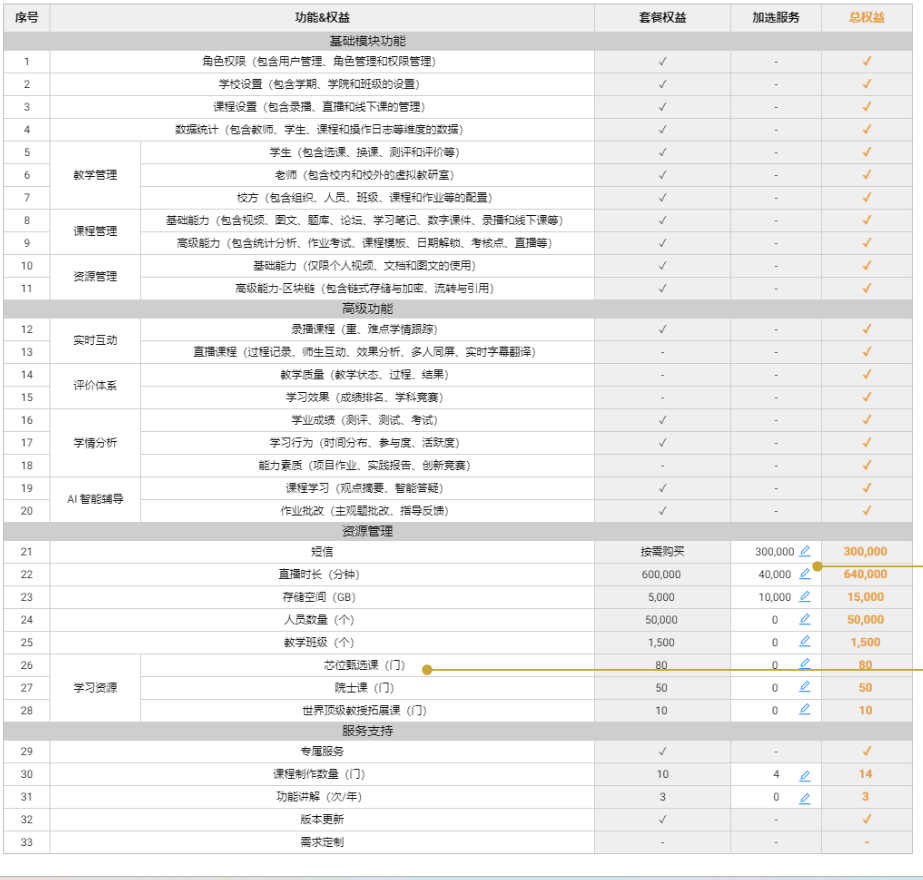
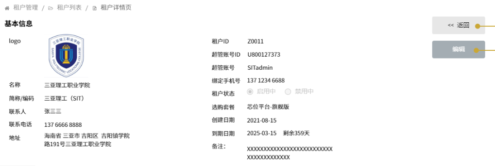
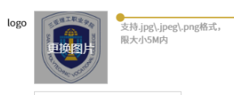
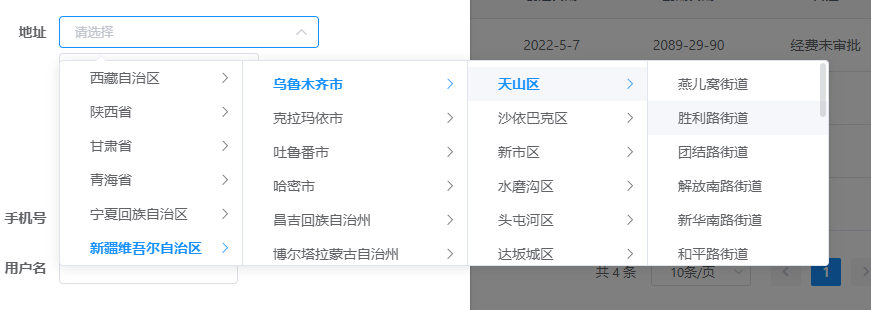
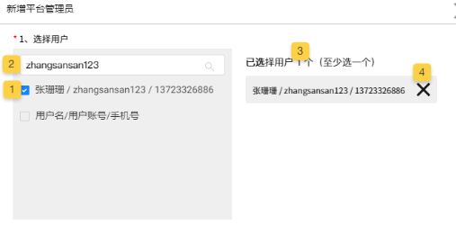

## 项目简单情况
Vue2+js的老项目，五六年了。还在用node14版本。
项目要求是写新页面，租户管理和用户管理，数据比较复杂，每个请求数据都很多。目前先写静态页面
一些主要页面：





大多是列表展示或者编辑页面，数据也比较复杂
还有复杂的列表：

总之写起来相当麻烦

## 各个问题及解决方法
### 1.详情页的布局：

这种布局看起来是使用el-descriptions分两列（column=2）就好了，但是会发现logo那一行占得太高了。因为左右是一一对应的。
解决方法是使用两个el-descriptions，然后用el-row,el-col分成两列，这样就会像设计图一样紧凑

tips：el-row,el-col布局真的非常好用，可以多用

### 2.上传图片遮罩层

普通的上传文件直接使用el-upload足够，如果需要遮罩层的话需要自己写了
结构：
```
  <el-upload
              class="avatar-uploader"
              :headers="licenseUploadImg.headers"
              action="#"
              :data="licenseUploadImg.data"
              :show-file-list="false"
              :on-success="
                (response, file, fileList) =>
                  handleFileSuccessImg(response, file, fileList)
              "
              :before-upload="beforeAvatarUpload"
            >
              
              <div v-else class="avatar">
                <i class="el-icon-plus avatar-uploader-icon"></i>
              </div>
              <!-- 遮罩层 -->
              <div class="mask">更换图片</div>
              <div slot="tip" class="el-upload__tip_contentManage">
                限制大小在5M内的.jpg\.jpeg\.png格式文件
              </div>
            </el-upload>
```

样式：
```
  $picSize: 100px;
  .avatar-uploader {
    position: relative;
    .avatar {
      width: $picSize;
      height: $picSize;
      border: 1px dashed #d9d9d9;
      border-radius: 5px;
      line-height: $picSize;
    }
    .mask {
      position: absolute;
      height: $picSize;
      width: $picSize;
      line-height: $picSize;
      text-align: center;
      top: 0;
      left: 0;
      opacity: 0;
      background: rgba(0, 0, 0, 0.5);
      border-radius: 10%;
      transition: 0.3s all;
      display: flex;
      align-items: center;
      justify-content: center;
      color: white;
      > i {
        display: none;
      }
    }
    .mask:hover {
      opacity: 0.6;
    }
  }
```
思路就是透明度设为0，鼠标悬浮的时候显示出来

### 3.地址选择框
新增用户的时候需要输入用户地址，就需要一个地址选择框：


方法是首先在网上找别的从官方发布渠道爬好的数据: [项目地址](https://github.com/modood/Administrative-divisions-of-China/tree/master/dist)

然后把json文件放入项目中，在vue文件中引入：
```
let pcas = require("../pcas-code.json");

...
 data() {
    return {
      options: pcas, //地区数据
    }
    }

```
最后在级联选择框中使用就好了。要注意级联选择框中参数用的是value和label，所以json文件中的字段名也要手动改一下：
```
          <el-cascader
            :options="options"
            v-model="addTenantForm.address"
            @change="handleChange"
          ></el-cascader>
```
### 4.实现一个类似穿梭框的功能（搜索功能还没实现）
设计图

逻辑上挺简单，就是每次数据变化的时候把选中的数据放进右侧列表数据中
选择框结构代码：
```
            <el-checkbox-group
              v-model="addAdminForm.users"
            >
              <el-checkbox
                v-for="user in addAdminUserList"
                :key="user.id"
                :label="user"
                style="margin-top: 10px"
              >
                {{ user.label }}
              </el-checkbox>
            </el-checkbox-group>
```
展示：
```
          <div>已选择用户1个(至少选一个)</div>
          <div class="pickBox">
            <div
              v-for="user in addAdminForm.users"
              :key="user.id"
              style="margin-top: 10px"
            >
              {{ user.label }}
            </div>
          </div>
```
数据(addAdminUserList就不写了，就是一组用户数据)：
```
  addAdminForm: {
        users: [],
        roles: [],
      },
```
布局使用的还是el-row和el-col，分两栏，然后添加上背景等细节

### 5.开发环境部署
老项目部署环境也会出问题。首先使用的是node14版本。
本来我平时是使用nvm管理版本的，但是对14版本的node，nvm下载不了其对应的npm，只能手动下载。
node官网地址：https://nodejs.org/download/release/v14.21.3/

当然，安装好了之后，以后想卸载还要下点功夫：
参考：