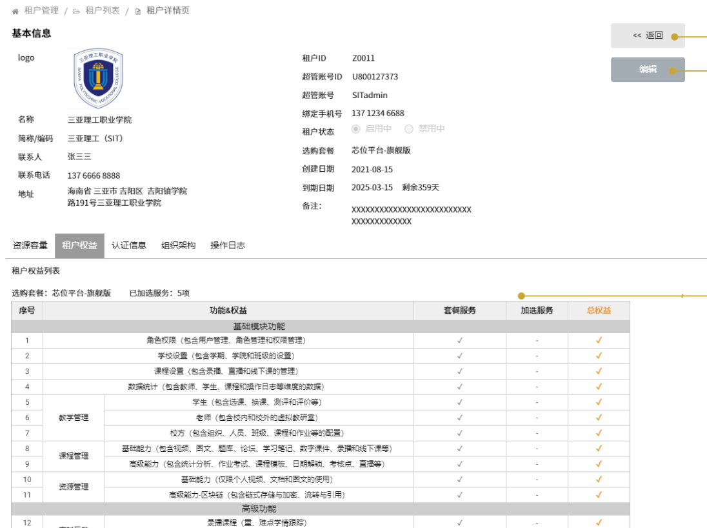

## 项目简单情况
Vue2+js的老项目，五六年了。还在用node14版本。
项目要求是写新页面，租户管理和用户管理，数据比较复杂，每个请求数据都很多。目前先写静态页面
一些主要页面：





大多是列表展示或者编辑页面，数据也比较复杂
还有复杂的列表：

总之写起来相当麻烦

## 各个问题及解决方法
### 0.开发环境部署
老项目部署环境也会出问题。首先使用的是node14版本。
本来我平时是使用nvm管理版本的，但是对14版本的node，nvm下载不了其对应的npm，只能手动下载。
node官网地址：https://nodejs.org/download/release/v14.21.3/

当然，安装好了之后，以后想卸载还要下点功夫：
参考：https://myblogs-e31.pages.dev/blog/node

### 1.详情页的布局：

这种布局看起来是使用el-descriptions分两列（column=2）就好了，但是会发现logo那一行占得太高了。因为左右是一一对应的。
解决方法是使用两个el-descriptions，然后用el-row,el-col分成两列，这样就会像设计图一样紧凑

tips：el-row,el-col布局真的非常好用，可以多用

### 2.上传图片遮罩层

普通的上传文件直接使用el-upload足够，如果需要遮罩层的话需要自己写了
结构：
```
  <el-upload
              class="avatar-uploader"
              :headers="licenseUploadImg.headers"
              action="#"
              :data="licenseUploadImg.data"
              :show-file-list="false"
              :on-success="
                (response, file, fileList) =>
                  handleFileSuccessImg(response, file, fileList)
              "
              :before-upload="beforeAvatarUpload"
            >
              
              <div v-else class="avatar">
                <i class="el-icon-plus avatar-uploader-icon"></i>
              </div>
              <!-- 遮罩层 -->
              <div class="mask">更换图片</div>
              <div slot="tip" class="el-upload__tip_contentManage">
                限制大小在5M内的.jpg\.jpeg\.png格式文件
              </div>
            </el-upload>
```

样式：
```
  $picSize: 100px;
  .avatar-uploader {
    position: relative;
    .avatar {
      width: $picSize;
      height: $picSize;
      border: 1px dashed #d9d9d9;
      border-radius: 5px;
      line-height: $picSize;
    }
    .mask {
      position: absolute;
      height: $picSize;
      width: $picSize;
      line-height: $picSize;
      text-align: center;
      top: 0;
      left: 0;
      opacity: 0;
      background: rgba(0, 0, 0, 0.5);
      border-radius: 10%;
      transition: 0.3s all;
      display: flex;
      align-items: center;
      justify-content: center;
      color: white;
      > i {
        display: none;
      }
    }
    .mask:hover {
      opacity: 0.6;
    }
  }
```
思路就是透明度设为0，鼠标悬浮的时候显示出来

### 3.地址选择框
新增用户的时候需要输入用户地址，就需要一个地址选择框：


方法是首先在网上找别的从官方发布渠道爬好的数据: [项目地址](https://github.com/modood/Administrative-divisions-of-China/tree/master/dist)

然后把json文件放入项目中，在vue文件中引入：
```
let pcas = require("../pcas-code.json");

...
 data() {
    return {
      options: pcas, //地区数据
    }
    }

```
最后在级联选择框中使用就好了。要注意级联选择框中参数用的是value和label，所以json文件中的字段名也要手动改一下：
```
          <el-cascader
            :options="options"
            v-model="addTenantForm.address"
            @change="handleChange"
          ></el-cascader>
```

2024/4/26更新 前面的推倒重来
地址数据在后端存的有，需要接口从后端获取

页面加载的时候提前获取 省 数据，选择省之后在change事件中获取市，以此类推
问题在于重新选择省、市、县之后，更低级的数据都要清空重来，所以需要在change中清空，重新请求数据。

因为还有别的地方会用到这个功能，所以封装了一个组件
```
<template>
  <div class="wider">
    <el-row :gutter="20">
      <el-col :span="6">
        <el-select
          v-model="provience"
          @change="
            (id) => {
              areaChange(1, id);
            }
          "
          placeholder="省"
        >
          <el-option
            v-for="item in provinceList"
            :key="item.id"
            :label="item.name"
            :value="item.id"
          >
          </el-option>
        </el-select>
      </el-col>
      <el-col :span="6">
        <el-select
          v-model="city"
          @change="
            (id) => {
              areaChange(2, id);
            }
          "
          placeholder="市"
        >
          <el-option
            v-for="item in cityList"
            :key="item.id"
            :label="item.name"
            :value="item.id"
          >
          </el-option>
        </el-select>
      </el-col>
      <el-col :span="6">
        <el-select
          v-model="county"
          @change="
            (id) => {
              areaChange(3, id);
            }
          "
          placeholder="区县"
        >
          <el-option
            v-for="item in countyList"
            :key="item.id"
            :label="item.name"
            :value="item.id"
          >
          </el-option>
        </el-select>
      </el-col>
      <el-col :span="6">
        <el-select
          v-model="infraAreaId"
          placeholder="乡镇"
          @change="
            (id) => {
              areaChange(4, id);
            }
          "
        >
          <el-option
            v-for="item in townList"
            :key="item.id"
            :label="item.name"
            :value="item.id"
          >
          </el-option>
        </el-select>
      </el-col>
    </el-row>

    <el-input
      v-model="detailAddress"
      style="margin-top: 5px"
      placeholder="请输入详细地址"
      @change="sendAddress"
    />
  </div>
</template>

<script>
<!-- getAreaByLevel 根据区域等级获取本等级所有地址信息 -->
<!-- 区域等级：1：省 2：市 3：县 4：镇  -->
<!-- getAreaByParentId 根据某个区域的id，获取本区域所有的下级区域 如获取河南省下所有市 -->
import { getAreaByLevel, getAreaByParentId } from "@/api/tenant/list";
export default {
  name: "address",
  props: ["detailAddress"],
  data() {
    return {
      // 选择地址要用的
      provinceList: [],
      provience: undefined,
      cityList: [],
      city: undefined,
      countyList: [],
      county: undefined,
      townList: [],
      infraAreaId: undefined,
      detailAddress: this.detailAddress,//detailAddress回填
    };
  },
  created() {
    this.getProvienceList();
  },
  methods: {
    async getProvienceList() {
      const res = await getAreaByLevel(1);
      if (res.code == 200) {
        this.provinceList = res.data;
      }
    },
    /*
     *type表示获取的是哪一级的区域信息【1,2,3,4】【省，市，县，镇】
     */
    async getAreaListByParentId(parentId, type) {
      const res = await getAreaByParentId(parentId);
      console.log(res);

      if (res.code == 200) {
        if (type == 2) this.cityList = res.data;
        if (type == 3) this.countyList = res.data;
        if (type == 4) this.townList = res.data;
      }
    },

    /*
     * type表示获取的是哪一级的区域信息【1,2,3,4】【省，市，县，镇】
     * 根据type的值确定哪些数据要清空
     */
    areaChange(type, currentId) {
      // 清楚已选数据
      if (type <= 1) {
        this.cityList = [];
        this.city = undefined;
      }
      if (type <= 2) {
        this.countyList = [];
        this.county = undefined;
      }
      if (type <= 3) {
        this.townList = [];
        this.infraAreaId = undefined;
      }
      if (type == 4) {
        this.infraAreaId = currentId;
        this.sendAddress();
        return;
      }

      // 获取新的下级列表
      this.getAreaListByParentId(currentId, type + 1);
    },
    sendAddress() {
      this.$emit("addressChange", {
        infraAreaId: this.infraAreaId,
        detailAddress: this.detailAddress,
      });
    },
  },
};
</script>

<style lang="scss" scoped>
.wider {
  width: 300px;
}
</style>
```

使用组件时传入addressChange事件处理函数和detailAddress属性就行了

TODO：区域选择现在还没有初始化数据


### 4.实现一个类似穿梭框的功能（搜索功能还没实现）
设计图

逻辑上挺简单，就是每次数据变化的时候把选中的数据放进右侧列表数据中
选择框结构代码：
```
            <el-checkbox-group
              v-model="addAdminForm.users"
            >
              <el-checkbox
                v-for="user in addAdminUserList"
                :key="user.id"
                :label="user"
                style="margin-top: 10px"
              >
                {{ user.label }}
              </el-checkbox>
            </el-checkbox-group>
```
展示：
```
          <div>已选择用户1个(至少选一个)</div>
          <div class="pickBox">
            <div
              v-for="user in addAdminForm.users"
              :key="user.id"
              style="margin-top: 10px"
            >
              {{ user.label }}
            </div>
          </div>
```
数据(addAdminUserList就不写了，就是一组用户数据)：
```
  addAdminForm: {
        users: [],
        roles: [],
      },
```
布局使用的还是el-row和el-col，分两栏，然后添加上背景等细节

### 5.test和dev环境下样式不同的问题
最开始dev环境后台出了问题，无法登陆，所以先用test环境开发，运行的是npm run test
写完页面之后，dev环境好了，于是使用npm run dev。代码都是同一个分支的代码
于是出现问题：
test的样式：


dev的样式：


排查发现少了.avatar-uploader-icon .avatar-uploader .el-upload这几个类。应该是其他组件写样式没有写scoped，被污染了
因为是老项目，所以不敢动别的组件，于是在公共组件文件中加上样式就好了

具体为什么test环境是正常的，还不知道

### 6.使用el-date-picker 组件选择日期后，默认为当天的23：59：59
1. 后端接口“套餐到期日期”要求传递yyyy-MM-dd HH:mm:ss格式,用户选择日期，具体时间是日期的最后一秒。
刚开始的做法是修改 value-format 属性为：
`value-format="yyyy-MM-dd 23:59:59"`
问题解决。
2. 然后发现，另一个接口其他要求相同，但是数据格式要时间戳（吐槽，狗后端不能统一一下格式？）。
这时有两种做法，一是value-format不变，发送请求前计算出时间戳
`new Date(this.addTenantForm.expireDate).getTime()`
二是修改`value-format="yyyy-MM-dd"` ,在请求前计算出时间戳
`new Date(this.addTenantForm.expireDate).getTime() + 24*60*60*1000 -1000`
第一种比较好用，符合直觉

3.于是出现了第三个问题，搜索功能中，需要时间范围为起始时间当天第一秒，结束时间为最后一秒


于是只能计算时间
```
     // createDateRange在清空后会变成null
      if (this.createDateRange && this.createDateRange.length !== 0) {
        params.createTimeStart = this.createDateRange[0] + " 00:00:00";
        params.createTimeEnd = this.createDateRange[1] + " 23:59:59";
      }
      if (this.expireDateRange && this.expireDateRange.length !== 0) {
        params.expireTimeStart = this.expireDateRange[0] + " 00:00:00";
        params.expireTimeEnd = this.expireDateRange[1] + " 23:59:59";
      }
```

### 7.使用el-tree，更新选中数据后视图不更新问题
```
  <el-tree
    :disabled="true"
    class="tree-border"
    :data="menuOptions"
    show-checkbox
     ref="menu"
     node-key="id"
     empty-text="加载中，请稍后"
     :props="defaultProps"
    :default-checked-keys="checkedKeys"
  ></el-tree>
```

页面初始化的时候请求获取defaultProps和checkedKeys数据，此时是正常的
当checkedKeys数据修改后，试图不变
解决方法：问题出在`:default-checked-keys="checkedKeys"`这个属性只能用来初始化数列表，想要试图更新，需要这样
```
  await this.getMenus();
  this.$refs.menu.setCheckedKeys(this.checkedKeys);
```
第一步获取数据，第二步更新视图