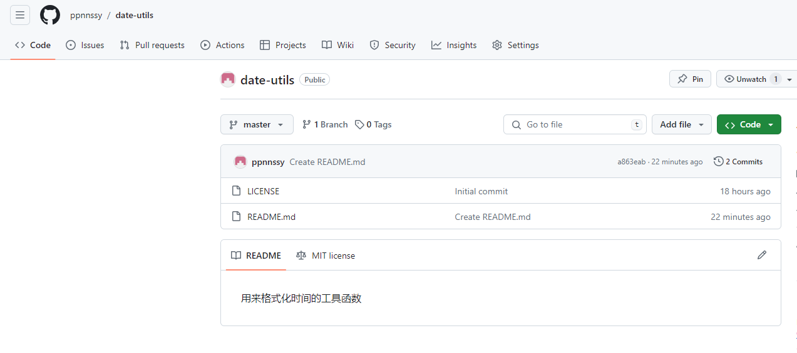
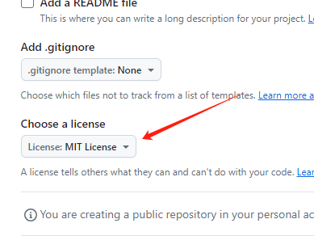
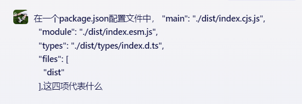
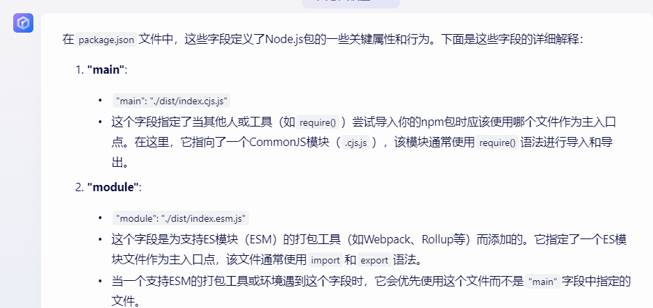
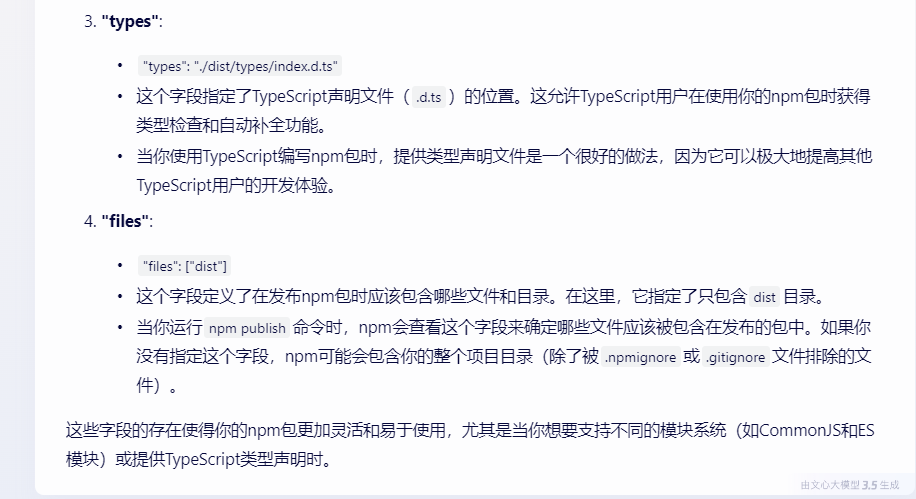
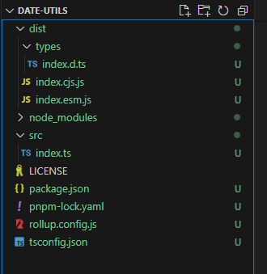
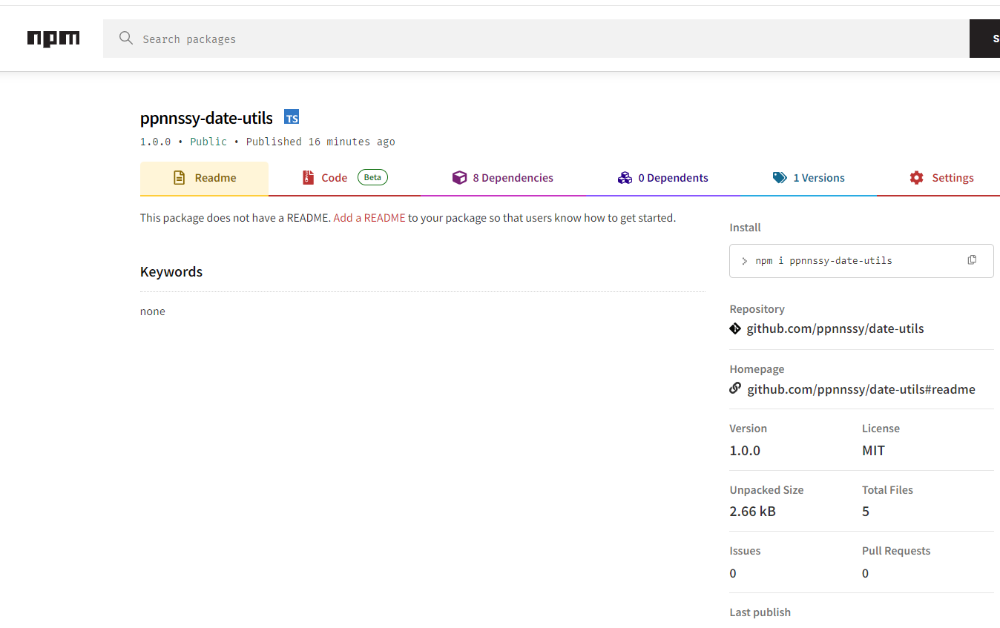

## 1.起因

起因是前两个项目，用了不少格式化时间的函数，都是在项目中的 utils 文件夹中写着。npm 上肯定有现成的依赖包，但是我想发布一个自己的。
一是能自定义功能，方便自己的项目使用，二是学习一下怎么发布

## 2.项目准备

首先要有个 github 的代码仓库。新建一个，拉取下来：


注意新建的时候选择 license，这是开源协议，没有的话没法发布 npm 包，后面 package.json 配置文件中也会有这一项



运行 `npm init`，创建初始的 package.json 文件

安装依赖。这次选择的是 rollup 作为打包工具。其实也能选择别的，比如 webpack。看特性选择吧
`pnpm add rollup`

安装插件
`pnpm add @rollup/plugin-commonjs @rollup/plugin-node-resolve @rollup/plugin-typescript`

`pnpm add tslib typescript`

`pnpm add rollup-plugin-terser rollup-plugin-cleanup`
关于插件的功能，可以百度看看
rollup-plugin-terser 插件用于代码压缩
rollup-plugin-cleanup 插件用于去除无效代码

由于要使用 ts 写代码，所以配置 ts 环境

`npx tsc --init`

## 3.项目配置
修改 tsconfig.json 文件如下：

```
{
  "compilerOptions": {
    "baseUrl": ".",
    "target": "es5",
    "lib": ["dom", "dom.iterable", "esnext"],
    "allowJs": true,
    "skipLibCheck": true,
    "esModuleInterop": true,
    "allowSyntheticDefaultImports": true,
    "strict": true,
    "forceConsistentCasingInFileNames": true,
    "noFallthroughCasesInSwitch": true,
    "module": "esnext",
    "moduleResolution": "node",
    "resolveJsonModule": true,
    "isolatedModules": true,
    "downlevelIteration": true,
    // 是否自动创建类型声明文件
    "declaration": true,
    // 类型声明文件的输出目录
    "declarationDir": "dist/types",
    // 只生成声明文件，而不会生成js文件
    "emitDeclarationOnly": true,
    // 指定输出文件目录(用于输出)，用于控制输出目录结构
    "rootDir": "src",
    "paths": {
      "@/*": ["src/*"],
      "@types/*": ["src/types/*"],
      "@utils/*": ["src/utils/*"]
    }
  },
  "include": ["src"]
}
```

如果要为工具库生成类型声明文件则必须有如下配置

```
{
	// 是否自动创建类型声明文件
    "declaration": true,
    // 类型声明文件的输出目录
    "declarationDir": "dist/types",
    // 只生成声明文件，而不会生成js文件
    "emitDeclarationOnly": true,
    // 指定输出文件目录(用于输出)，用于控制输出目录结构
    "rootDir": "src",
}
```
配置rollup(配置打包工具真是让人头大)，参考https://www.rollupjs.com/

在项目根目录下新建文件rollup.config.js，关于rollup的详细配置可参考官网教程。对于我们的工具库而言，rollup可简单配置如下：
```
import resolve from '@rollup/plugin-node-resolve';
import commonjs from '@rollup/plugin-commonjs';
import typescript from '@rollup/plugin-typescript';
import { terser } from 'rollup-plugin-terser';
import cleanup from 'rollup-plugin-cleanup';

export default [
    {
        input: './src/index.ts',
        output: {
            dir: 'dist',
            format: 'cjs',
            entryFileNames: '[name].cjs.js',
        },
        plugins: [resolve(), commonjs(), typescript(), terser(), cleanup()],
    }, {
        input: './src/index.ts',
        output: {
            dir: 'dist',
            format: 'esm',
            entryFileNames: '[name].esm.js',
        },
        plugins: [resolve(), commonjs(), typescript(), terser(), cleanup()],
    }
];
```

这里要注意，因为使用了import引入，所以package.json中要配置`"type": "module"`,否则打包的时候报错

## 4.写代码
新建src/index.ts文件。写个函数：
```
// 返回传入的日期是今年的第几天,如果不传参数则默认是当前日期
export const dayOfYear = (date?: Date | string): number => {
  let formatDate = null;
  if (!date) {
    formatDate = new Date();
  } else {
    formatDate = typeof date === "string" ? new Date(date) : date;
  }
  // 如果传入的是无效的字符串,那么就默认是当前日期
  if (!formatDate.getFullYear) {
    formatDate = new Date();
  }
  const year = formatDate.getFullYear();
  const firstDayOfYear = new Date(year, 0, 0);
  const timeGap = formatDate.getTime() - firstDayOfYear.getTime();
  return Math.floor(timeGap / 1000 / 60 / 60 / 24);
};
```

完善package.json文件
```
{
  "name": "ppnnssy-date-utils",
  "version": "1.0.0",
  "description": "前端时间相关工具函数",
  "main": "./dist/index.cjs.js",
  "module": "./dist/index.esm.js",
  "types": "./dist/types/index.d.ts",
  "files": [
    "dist"
  ],
  "scripts": {
    "dev": "rollup -w -c",
    "test": "echo \"Error: no test specified\" && exit 1",
    "build:types": "tsc -b ./tsconfig.json",
    "build": "npm run build:types && rollup -c"
  },
  "repository": {
    "type": "git",
    "url": "git+https://github.com/ppnnssy/date-utils.git"
  },
  "author": "ppnnssy",
  "license": "MIT",
  "dependencies": {
    "@rollup/plugin-commonjs": "^25.0.7",
    "@rollup/plugin-node-resolve": "^15.2.3",
    "@rollup/plugin-typescript": "^11.1.6",
    "rollup": "^4.17.2",
    "rollup-plugin-cleanup": "^3.2.1",
    "rollup-plugin-terser": "^7.0.2",
    "tslib": "^2.6.2",
    "typescript": "^5.4.5"
  },
  "type": "module"
}
```
问一下AI其中某些字段的含义：


文心一言这样回答的：



还行，当个搜索引擎还没有太智障

## 5.打包发布
打包文件：

`pnpm build`

生成了dist文件夹，目前的文件结构：



注册个npm账号，然后在终端登录：

`npm login`
可能需要验证一下

登录之后发布

`npm publish`

成功的话就能看到自己的包了

