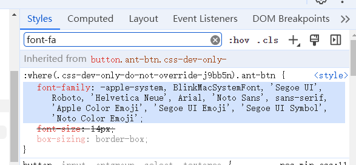
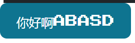

## 起因
朋友在参加一个SUIMove活动，制作一个随机红包网站作为作品。前端页面需要帮助。于是帮忙写前端
风格使用了像素风（主要是因为有个别人的成品页面作为UI参考）

## 技术参考
样式：CSS和tailwind混着写的
字体：[Press Start 2P](https://fonts.google.com/specimen/Press+Start+2P)
像素风组件：[NES.css](https://nostalgic-css.github.io/NES.css/)

## 搭建过程
1.创建React项目。虽然现在都用NEXT.js，但是为了方便，还是直接用React `npx create-react-app my-project`


2.安装tailwindcss,参考官方文档https://tailwindcss.com/docs/guides/create-react-app
前两步可以合并成一步的`npx create-react-app my-project` 

3.使用Press Start 2P字体 https://fonts.google.com/specimen/Press+Start+2P
    注意这个字体不支持中文
    首先在index.html中引入字体

```
<link rel="preconnect" href="https://fonts.googleapis.com">
<link rel="preconnect" href="https://fonts.gstatic.com" crossorigin>
<link href="https://fonts.googleapis.com/css2?family=Press+Start+2P&display=swap" rel="stylesheet">
```

然后在index.css中设置字体

```
body {
  margin: 0;
  font-family:"Press Start 2P" , 'Segoe UI', 'Roboto', 'Oxygen',
    'Ubuntu', 'Cantarell', 'Fira Sans', 'Droid Sans', 'Helvetica Neue',
    sans-serif;
  -webkit-font-smoothing: antialiased;
  -moz-osx-font-smoothing: grayscale;
}
```

4.安装NES.css
说明文档：https://nostalgic-css.github.io/NES.css/
安装：`npm install nes.css`
引入样式：在index.jss中引入:`import "nes.css/css/nes.min.css";`
使用组件：`<button type="button" className="nes-btn is-primary">Primary</button>`
可以看到就是使用样式改变的组件效果。比如nes-btn类名，给h2加上也能显示出button效果

```
        <main style={{ padding: "1rem 0" }}>
          <h2 className="text-3xl font-bold underline nes-btn">我是Tab1</h2>
          <button onClick={()=>{ navigate("/")}}>Home</button>

          <button type="button" className="nes-btn is-primary">Primary</button>
        </main>
```

显示效果


## 注意事项
antd组件中的文字不能显示像素风效果，如`<Button>你好啊ABASD</Button>`中就是普通字体
原因是组件中写了font-family样式



覆盖了原字体样式

所以可以使用Flowbite React组件库：https://flowbite-react.com/docs/getting-started/introduction
这是个使用tailwind写的组件库，不会覆盖原本的样式

安装Flowbite React：https://flowbite-react.com/docs/guides/create-react-app#install-flowbite-react

使用组件：
```
import { Button } from "flowbite-react";

...

  <Button>你好啊ABASD</Button>
```

效果：



button中的字体就变成了像素风

## 总结
不难，但是效果还是挺好玩的，以后自己想做什么东西的时候可以参考