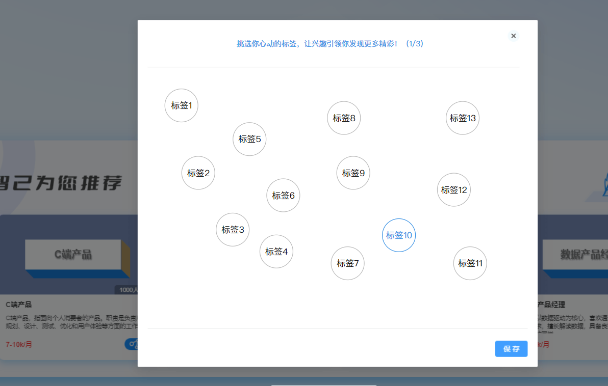

## 需求
智己项目的原型图中，有个弹框是选择感兴趣的标签：



标签需要散落不重复，且不能超出弹框范围。
好在弹框大小是固定的。

## 思路
首先基本思路是随机生成坐标，随机范围就是父div的大小，然后使用定位属性left，right调整位置
要实现不重叠，每生成一个坐标，就要判断和之前生成的坐标是否重叠，如果重叠就重新生成。

## 实现
结构：

```
    <div class="interest-content-body">
       <div class="label_btn" v-for="(item,index) in positions" :style="{left:item[0]+'px',top:item[1]+'px'}">{{ index }}</div>
    </div>
```
positions结构是二维数组，保存了坐标信息

样式
```
       .label_btn{
            width: 50px;
            height: 50px;
            border-radius: 50%;
            background-color: gray;
            position: absolute;
          
        }
```

js部分
```js
// 生成随机位置
// TODO 生成数量较多的话，可能会多次无法命中合适的位置，导致网页卡顿甚至卡死
const positions=ref([])
const createPt=()=>{
    // 父盒子宽800 高300
   for(let i=0;i<30;i++){
    positions.value.push(createOnePt()) 
   }

    console.log(positions.value);
}

// 创建一个位置
const createOnePt=()=>{
    let left
    ,top
    do{
        left =Math.floor(Math.random() * (800 - 50)) ;  
        top =Math.floor( Math.random() * (300 - 50));  
    }while(isOverlap(left,top))
    return [left,top]
}

// 检测是否重叠
const isOverlap=(left,top)=>{
   
  const res = positions.value.some((val)=>{
        // console.log(val);
        let dx=left-val[0]
        let dy=top-val[1]
       
        const distance = Math.sqrt(dx * dx + dy * dy);  
        console.log(distance);
        return distance < 70
    })

    return res
}

onBeforeMount(()=>{
    createPt()
})
```