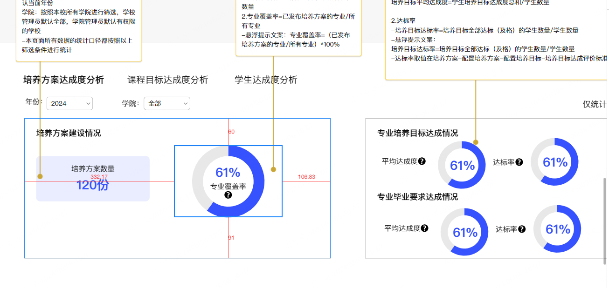
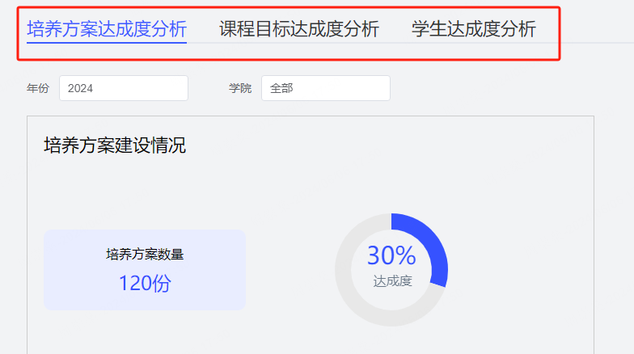
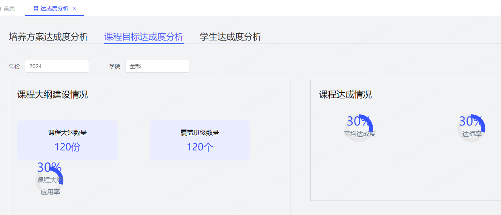

## 吐槽在先
正开发saas教学管理系统呢，活都分配好了，框架写好了，产品经理没了，笑死
产品线的头头早晚把整个公司搞黄喽
saas暂停，先去干教学管理系统的活，主要是几个图标，正好熟悉一下echarts

## 项目说明
需要达成的效果：



明显是要封装一个圆环图组件的。原项目中有封装，但是是一个完整功能的圆环图，用起来比较麻烦。这个需求只需要传一个值就够了，所以单独封装个简单的

## 参考
官方示例：https://echarts.apache.org/examples/zh/editor.html?c=pie-doughnut&lang=ts
官方文档：https://echarts.apache.org/zh/option.html#title
大佬的花样绘图：http://chart.majh.ltd/

## 开发过程

### 1.使用echarts

#### 源码
封装的组件代码：
```
<template>
  <div id="PieChart" class="echarts"></div>
</template>

<script setup lang="ts">
import { ECharts, EChartsOption, init } from "echarts";
import { onMounted, defineProps } from "vue";
const props = defineProps(["num", "label"]);
interface InitData {
  num: number;
  label?: string;
}
const initChart = (data: InitData) => {
  let formatter = `{total|${data.num}%}`;
  if (data.label) {
    formatter = formatter + "\n\r" + `{active|${data.label}}`;
  }
  const charEle = document.getElementById("PieChart")!;
  const charEch: ECharts = init(charEle);
  const colors = ["#3652FF", "#E8E8E8"];
  const option: EChartsOption = {
    color: colors,
    series: [
      {
        name: "达成情况",
        type: "pie",
        radius: ["50%", "70%"],
        avoidLabelOverlap: false,
        label: {
          normal: {
            show: true,
            position: "center",
            color: "#4c4a4a",
            formatter,
            rich: {
              total: {
                fontSize: 30,
                fontFamily: "微软雅黑",
                color: "#3652FF",
              },
              active: {
                fontFamily: "微软雅黑",
                fontSize: 16,
                color: "#6c7a89",
                lineHeight: 30,
              },
            },
          },
        },
        // emphasis: {
        //   label: {
        //     show: true,
        //     fontSize: 40,
        //     fontWeight: "bold",
        //   },
        // },
        labelLine: {
          show: false,
        },
        data: [
          { value: props.num, name: "达成度" },
          { value: 100 - props.num, name: "未达成" },
        ],
      },
    ],
  };

  charEch.setOption(option);
};

onMounted(() => {
  initChart({ num: props.num, label: props.label });
});
</script>

<style lang="scss" scoped>
.echarts {
  width: 100%;
  height: 100%;
  margin: 0 auto;
}
</style>
```

代码说明：
重点是配置项中的label项，因为圆环里面的两行字体不同

所以每一行要单独配置
其他的都是常规配置，不多说

使用组件：

`<Pie :num="30" label="达成度" />`

#### 其他解决方案
也可以使用title属性，参考
http://chart.majh.ltd/xJzYGTWCSr

#### 一个坑
使用el-tab分成三页


第一页是正常的，切换到第二页时就不对了

容器大小丢失了。
原因是标签页下的内容在初始化这个标签组件时就已经被渲染完成了，当你点击标签，图表就会变成默认的宽高

解决方法：给选项卡加上 :lazy="true" ，延迟渲染就行了
此方法仅适用于 echarts 图表是以子组件的方式引入的情况，如果你的图表是直接在标签组件里写的并且渲染的，是无法生效的；而且会报错
因为延迟加载的时候没有父容器


### 2.使用ProTable
之前的应该是银龄教师管理系统遇到过这个问题，数据显示不出来
当时时间太紧，没时间仔细研究，最后把任务给了熟悉这个组件的同事。
这次有时间，看了一下组件的源码：
官网：https://docs.spicyboy.cn/
组件文档：https://juejin.cn/post/7166068828202336263#heading-14

杜文博封装的系统，可以直接问但是没必要，扒拉一下源码完事。文档写的不太行，比如我遇到的问题，传入了getDataApi函数之后，数据却不显示，文档中没有找到解决办法。
以下是阅读源码解决问题的过程：

1.根据文档说明，使用ProTable如下：
```
     <ProTable
        ref="proTable"
        title="成绩评价总览"
        row-key="path"
        :indent="30"
        :columns="columns"
        :request-api="getTableList"
        :pagination="true"
      >
        <!-- 菜单操作 -->
        <template #operation="scope">
          <el-button type="primary" link :icon="EditPen" @click="openDrawer('编辑', scope.row)"> 编辑 </el-button>
          <el-button type="primary" link :icon="EditPen" @click="openDrawer('新增', scope.row)"> 新增 </el-button>
          <el-button type="primary" link :icon="Delete" @click="deleteRow(scope.row)"> 删除 </el-button>
        </template>
      </ProTable>

      。。。

const getTableList = (params: {}) => {
  return Promise.resolve({
    [
        { name: "张三", nob: "10010" },
        { name: "李四", nob: "10011" },
      ],
  });
};
```

明显按照文档要求返回了一个Promise对象，对象中有表格数据，但是页面显示无数据
进入ProTable.vue组件中：

```
// 表格操作 Hooks
const {
  tableData,
  pageable,
  searchParam,
  searchInitParam,
  getTableList,
  search,
  reset,
  handleSizeChange,
  handleCurrentChange,
  refresh,
} = useTable(
  props.requestApi,
  props.initParam,
  props.pagination,
  props.dataCallback,
  props.requestError,
  tableRef,
  refreshTimeRef,
  props.isShowRefresh
);
```

看到requestApi是作为useTable的参数传入的，然后返回tableData数据。
那么进入useTable函数中看一看呢：

```
export const useTable = (
  api?: (params: any) => Promise<any>,
  initParam: object = {},
  isPageable: boolean = true,
  dataCallBack?: (data: any) => any,
  requestError?: (error: any) => void,
  tableRef?: any,
  refreshTimeRef?: any,
  isShowRefresh: boolean = false
) => {
  const state = reactive<Table.StateProps>({
    // 表格数据
    tableData: [],
    // 分页数据
    pageable: {
      // 当前页数
      pageNo: 1,
      // 每页显示条数
      pageSize: 10,
      // 总条数
      total: 0,
    },
    // 查询参数(只包括查询)
    searchParam: {},
    // 初始化默认的查询参数
    searchInitParam: {},
    // 总参数(包含分页和查询参数)
    totalParam: {},
  });

  ..........

    const getTableList = async () => {
    if (!api) return;
    try {
      // 先把初始化参数和分页参数放到总参数里面
      Object.assign(state.totalParam, initParam, isPageable ? pageParam.value : {});
      let { data } = await api({ ...state.searchInitParam, ...state.totalParam });
      dataCallBack && (data = dataCallBack(data));
      state.tableData = isPageable ? data.records : data;
      // 解构后台返回的分页数据 (如果有分页更新分页信息)
      if (isPageable) {
        const { current, size, total } = data;
        const pageNo = current;
        const pageSize = size;
        updatePageable({ pageNo, pageSize, total });
      }
      // await nextTick();
      // tableRef.value!.clearSelection(); // 清空选择项
    } catch (error) {
      requestError && requestError(error);
    }
  };

  ..........

  
  return {
    ...toRefs(state),
    getTableList,
    search,
    reset,
    handleSizeChange,
    handleCurrentChange,
    updatedTotalParam,
    refresh,
  };
};

```

看到` state.tableData = isPageable ? data.records : data;` 和 ` const { current, size, total } = data; ` 这两行。说明data中必须包含records，否则数据不能解构赋值

于是修改getTableList函数：
```
const getTableList = (params: {}) => {
  console.log(11111111);
  return Promise.resolve({
    data: {
      records: [
        { name: "张三", nob: "10010" },
        { name: "李四", nob: "10011" },
      ],
      total: 2,
    },
  });
};
```

正常显示了，问题解决（分页器可能还不对劲）

当然，以上都是mock数据，实际和后端对接的时候还要约定好返回数据的格式

## 总结
查文档找不到对应的配置项，文档东西太多了还没认真看，还是得靠网友的笔记啊