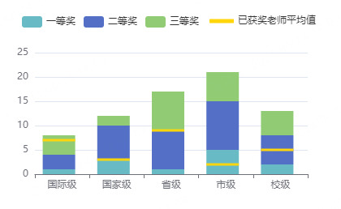
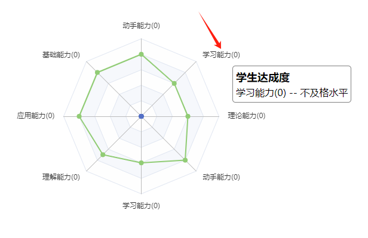

## 吐槽在先

正开发 saas 教学管理系统呢，活都分配好了，框架写好了，产品经理没了，笑死。

产品线的头头早晚把整个公司搞黄喽。

saas 暂停，先去干教学管理系统的活，主要是几个图标，正好熟悉一下 ECharts

## 项目说明

需要达成的效果：


明显是要封装一个圆环图组件的。原项目中有封装，但是是一个完整功能的圆环图，用起来比较麻烦。这个需求只需要传一个值就够了，所以单独封装个简单的

## 参考

官方示例：https://echarts.apache.org/examples/zh/editor.html?c=pie-doughnut&lang=ts

官方文档：https://echarts.apache.org/zh/option.html#title

大佬的花样绘图：http://chart.majh.ltd/

## 开发过程

### 1.使用 echarts

#### 源码

封装的组件代码：

```vue
<template>
  <div :id="'PieChart' + sign" class="echarts"></div>
</template>

<script setup lang="ts">
import { ECharts, EChartsOption, init } from "echarts";
import { onMounted, defineProps, ref, onBeforeMount } from "vue";

const sign = ref<number>(1);
onBeforeMount(() => {
  sign.value = Math.random() + 1;
});

// const props = defineProps(["num", "label"]);
const props = defineProps({
  num: {
    type: Number,
    default: 0,
  },
  label: {
    type: String,
    default: "",
  },
  size: {
    type: String,
    default: "mini",
  },
});
interface InitData {
  num: number;
  label?: string;
}

const initChart = (data: InitData) => {
  console.log("===>", props.size);

  let formatter = `{total|${data.num}%}`;
  if (data.label) {
    formatter = formatter + "\n\r" + `{active|${data.label}}`;
  }
  const charEle = document.getElementById(`PieChart` + sign.value)!;
  const charEch: ECharts = init(charEle);
  const colors = ["#3652FF", "#E8E8E8"];
  const option: EChartsOption = {
    color: colors,
    series: [
      {
        name: "达成情况",
        type: "pie",
        radius: ["50%", "70%"],
        avoidLabelOverlap: false,
        label: {
          show: true,
          position: "center",
          color: "#4c4a4a",
          formatter,
          rich: {
            total: {
              fontSize: props.size === "mini" ? 20 : 30,
              fontFamily: "微软雅黑",
              color: "#3652FF",
            },
            active: {
              fontFamily: "微软雅黑",
              fontSize: props.size === "mini" ? 14 : 16,
              color: "#6c7a89",
              lineHeight: 30,
            },
          },
        },
        // emphasis: {
        //   label: {
        //     show: true,
        //     fontSize: 40,
        //     fontWeight: "bold",
        //   },
        // },

        data: [
          { value: props.num, name: "达成度" },
          { value: 100 - props.num, name: "未达成" },
        ],
      },
    ],
  };

  charEch.setOption(option);
};

onMounted(() => {
  initChart({ num: props.num, label: props.label });
});
</script>

<style lang="scss" scoped>
.echarts {
  width: 100%;
  height: 100%;
  margin: 0 auto;
}
</style>

```

代码说明：
重点是配置项中的 label 项，因为圆环里面的两行字体不同


所以每一行要单独配置

其他的都是常规配置，不多说

使用组件：

`<Pie :num="30" label="达成度" />`

#### 其他解决方案

也可以使用 title 属性，参考
http://chart.majh.ltd/xJzYGTWCSr

#### 一个坑

使用 el-tab 分成三页


第一页是正常的，切换到第二页时就不对了

容器大小丢失了。
原因是标签页下的内容在初始化这个标签组件时就已经被渲染完成了，当你点击标签，图表就会变成默认的宽高

解决方法：给选项卡加上 :lazy="true" ，延迟渲染就行了
此方法仅适用于 echarts 图表是以子组件的方式引入的情况，如果你的图表是直接在标签组件里写的并且渲染的，是无法生效的；而且会报错
因为延迟加载的时候没有父容器

### 2.使用 ProTable

之前的应该是银龄教师管理系统遇到过这个问题，数据显示不出来
当时时间太紧，没时间仔细研究，最后把任务给了熟悉这个组件的同事。
这次有时间，看了一下组件的源码：

官网：https://docs.spicyboy.cn/

组件文档：https://juejin.cn/post/7166068828202336263#heading-14

杜文博封装的系统，可以直接问但是没必要，扒拉一下源码完事。文档写的不太行，比如我遇到的问题，传入了 getDataApi 函数之后，数据却不显示，文档中没有找到解决办法。
以下是阅读源码解决问题的过程：

1.根据文档说明，使用 ProTable 如下：

```
     <ProTable
        ref="proTable"
        title="成绩评价总览"
        row-key="path"
        :indent="30"
        :columns="columns"
        :request-api="getTableList"
        :pagination="true"
      >
        <!-- 菜单操作 -->
        <template #operation="scope">
          <el-button type="primary" link :icon="EditPen" @click="openDrawer('编辑', scope.row)"> 编辑 </el-button>
          <el-button type="primary" link :icon="EditPen" @click="openDrawer('新增', scope.row)"> 新增 </el-button>
          <el-button type="primary" link :icon="Delete" @click="deleteRow(scope.row)"> 删除 </el-button>
        </template>
      </ProTable>

      。。。

const getTableList = (params: {}) => {
  return Promise.resolve({
    [
        { name: "张三", nob: "10010" },
        { name: "李四", nob: "10011" },
      ],
  });
};
```

明显按照文档要求返回了一个 Promise 对象，对象中有表格数据，但是页面显示无数据
进入 ProTable.vue 组件中：

```
// 表格操作 Hooks
const {
  tableData,
  pageable,
  searchParam,
  searchInitParam,
  getTableList,
  search,
  reset,
  handleSizeChange,
  handleCurrentChange,
  refresh,
} = useTable(
  props.requestApi,
  props.initParam,
  props.pagination,
  props.dataCallback,
  props.requestError,
  tableRef,
  refreshTimeRef,
  props.isShowRefresh
);
```

看到 requestApi 是作为 useTable 的参数传入的，然后返回 tableData 数据。
那么进入 useTable 函数中看一看呢：

```
export const useTable = (
  api?: (params: any) => Promise<any>,
  initParam: object = {},
  isPageable: boolean = true,
  dataCallBack?: (data: any) => any,
  requestError?: (error: any) => void,
  tableRef?: any,
  refreshTimeRef?: any,
  isShowRefresh: boolean = false
) => {
  const state = reactive<Table.StateProps>({
    // 表格数据
    tableData: [],
    // 分页数据
    pageable: {
      // 当前页数
      pageNo: 1,
      // 每页显示条数
      pageSize: 10,
      // 总条数
      total: 0,
    },
    // 查询参数(只包括查询)
    searchParam: {},
    // 初始化默认的查询参数
    searchInitParam: {},
    // 总参数(包含分页和查询参数)
    totalParam: {},
  });

  ..........

    const getTableList = async () => {
    if (!api) return;
    try {
      // 先把初始化参数和分页参数放到总参数里面
      Object.assign(state.totalParam, initParam, isPageable ? pageParam.value : {});
      let { data } = await api({ ...state.searchInitParam, ...state.totalParam });
      dataCallBack && (data = dataCallBack(data));
      state.tableData = isPageable ? data.records : data;
      // 解构后台返回的分页数据 (如果有分页更新分页信息)
      if (isPageable) {
        const { current, size, total } = data;
        const pageNo = current;
        const pageSize = size;
        updatePageable({ pageNo, pageSize, total });
      }
      // await nextTick();
      // tableRef.value!.clearSelection(); // 清空选择项
    } catch (error) {
      requestError && requestError(error);
    }
  };

  ..........


  return {
    ...toRefs(state),
    getTableList,
    search,
    reset,
    handleSizeChange,
    handleCurrentChange,
    updatedTotalParam,
    refresh,
  };
};

```

看到` state.tableData = isPageable ? data.records : data;` 和 `const { current, size, total } = data;` 这两行。说明 data 中必须包含 records，否则数据不能解构赋值

于是修改 getTableList 函数：

```
const getTableList = (params: {}) => {
  console.log(11111111);
  return Promise.resolve({
    data: {
      records: [
        { name: "张三", nob: "10010" },
        { name: "李四", nob: "10011" },
      ],
      total: 2,
    },
  });
};
```

正常显示了，问题解决（分页器可能还不对劲）

当然，以上都是 mock 数据，实际和后端对接的时候还要约定好返回数据的格式

## 项目中使用 ECharts 其他问题及解决方法记录
主要原因是文档不熟，很多功能在配置项中都能解决，但是没有用过，而且文档太多，所以需要搜一下，然后看文档
问题顺序是开发的时候遇到的顺序，有点乱，将就看吧

### 一. 柱状图空隙，整体高度，柱子宽度调整
关于柱状图,这是调整前的图，有以下问题和解决方法：


1. 柱状图两个数据之间有空隙

中间这种的空隙，原型图上是没有的。消除的办法很简单，在最后一组数据上加上barGap: "0%"就行了。

2. 默认柱子太粗，加上 barWidth: 20 主动控制柱子宽度

3. 图整体高度默认比较低，手动调高：
```
   grid: {
      height: 130,
    },
```

最终代码：

```
    series: [
      {
        data: [100, 90, 85],
        barWidth: 20,
        type: "bar",
        name: "老师教学基本数据",
      },
      {
        data: [65, 100, 50],
        barWidth: 20,
        type: "bar",
        // 在最后一组数据上设置无缝隙
        barGap: "0%",
        name: "学校平均值",
      },
    ],
```

呈现效果：


### 二. 雷达图
雷达图遇到一个问题，但是头疼了好大会儿：


图例和图本身重合了。ECharts应该是没有优化好容器较小时的绘图，容器放大到700*700就没问题。但是项目中肯定不能随意调盒子大小。

解决方法是使用radar.radius属性把图缩小一些，并使用 center 属性控制图的位置（图例不动）：

```
    radar: {
      indicator: [
        { name: "章节平均分", max: 6500 },
        { name: "课程平均分", max: 16000 },
        { name: "考试平均分", max: 30000 },
        { name: "作业平均分", max: 38000 },
      ],
      radius: "65%",
      center: ["50%", "55%"],
      axisName: {
        //  字体颜色
        color: "#000",
      },
    },
```

最终效果：


### 三. X轴区间柱状图
一般柱状图x轴是这样的，柱子在分类名称的正上方：


需求中要做一个成绩统计，柱子在区间中：


解决方法：

基本思路是在x轴上弄两组数据。柱子正下方的x数据隐藏，另一组数据向左偏移半个相位显示：

```
    const xData = ["0", "20", "40", "60", "80", "90", "100"];
    const barData = [1, 5, 3, 12, 14, 7];

    //...

    xAxis: [
      { data: barData, show: false },
      {
        data: xData,
        position: "bottom",
        boundaryGap: false,
      },
    ],
    yAxis: {
      type: "value",
      show: false,
    },
```

首先使用barData做出一个x轴上的刻度标识，其实只要是和barData数组等长的数组都可以，如果不隐藏的话，效果是这样的：


由于还需要鼠标悬浮显示数值：


此时显示的还是错误的：

所以要对数值做处理：
```
  const xShowData = ["0", "20", "40", "60", "80", "90", "100"];
  const xTrueData = []; //这个数据主要是为了鼠标悬浮的时候显示出来
  xShowData.forEach((item, index) => {
    if (index == xShowData.length - 1) return;
    xTrueData.push(xShowData[index] + "-" + xShowData[index + 1] + "分");
  });
  const barData = [1, 5, 3, 12, 14, 7];
  // ...

      xAxis: [
      { data: xTrueData, show: false },
      {
        data: xShowData,
        position: "bottom",
        boundaryGap: false,
      },
    ],
```

这样就能正确显示了：


然后隐藏掉，并设置第二个真正要显示的刻度xData

这时候要注意使用` boundaryGap: false` 去除x轴的留白策略（可以看 [文档](https://echarts.apache.org/zh/option.html#xAxis.boundaryGap)），这样就正好偏移半个相位，这样就符合需求了

参考：https://www.cnblogs.com/jszhp/p/14866902.html

### 四. 柱状图上带高亮横杠

需求图：



这个黄色的横杠代表平均值，是另一组数据

这个需求实现有两个难点，一是高亮横杠，二是图例(legend)风格不统一的设置

实现思路：

一。黄色横杠用bar.series.markPoint实现。这是在一组数据上打标记用的，在最后一组数据上添加，并将yAxis设置为平均值就行了<br/>
二。因为一中实际上没有为平均值设置柱子，所以图例上不会显示这组数据。解决办法是设置一组空数据，并单独设计图例样式

实现代码：
```
  const average = [7, 3, 9, 2, 5];
  let rodData = [];
  average.forEach((item, index) => {
    // 设置markPoint数据
    rodData.push({
      symbol: "rect",
      symbolSize: [40, 3],
      xAxis: index,
      yAxis: item,
      value: item,
      // symbolOffset: [-20, 0],
      itemStyle: {
        color: "#FFD60C",
      },
      label: {
        show: false,
      },
      emphasis: {
        disabled: true,
      },
    });
  });

  option = {
    tooltip: {
      trigger: "axis",
      axisPointer: {
        type: "shadow",
      },
    },
    legend: [
      {
        data: ["一等奖", "二等奖", "三等奖"],
        left: "5%",
        top: "10",
      },
      {
        data: ["已获奖老师平均值"],
        left: "60%",
        itemHeight: 5,
        itemWidth: 30,
        top: "10",
        selectedMode: false,
        itemStyle: {
          color: "#FFD60C",
        },
      },
    ],

    grid: {
      height: 150,
    },
    xAxis: [
      {
        type: "category",
        data: ["国际级", "国家级", "省级", "市级", "校级"],
      },
    ],
    yAxis: [
      {
        type: "value",
      },
    ],
    series: [
      {
        name: "一等奖",
        type: "bar",
        stack: "medal",
        color: "#68BBC4",
        barWidth: 40,
        data: [1, 3, 1, 5, 2],
      },
      {
        name: "二等奖",
        type: "bar",
        stack: "medal",
        barWidth: 40,
        data: [3, 7, 8, 10, 6],
      },
      {
        name: "三等奖",
        type: "bar",
        stack: "medal",
        barWidth: 40,
        data: [4, 2, 8, 6, 5],
        markPoint: {
          data: rodData,
        },
      },
      // 设置这个值主要是为了legend显示
      {
        data: [],
        type: "bar",
        name: "已获奖老师平均值",
      },
    ],
  };
```

代码部分细节说明：
一。legend除了是一个对象，还可以是数组，用于对多组图例单独设置样式

二。因为已获奖老师平均值是空置，所以鼠标悬浮时是不显示这组值的，如下：


如果想要显示，就把空数组换成真实数据，然后隐藏柱子<br/>
隐藏柱子我一般用 barWidth: 0 <br/>
(但是这个办法在官方示例上不好用，会以默认宽度显示。我自己的页面上显示是正常的，不知道为啥官方示例上不行。)<br/>
或者保持空数组，转而使用tooltip.formatter来自定义显示数据


参考：https://blog.csdn.net/baozilianya/article/details/129907185?ops_request_misc=%257B%2522request%255Fid%2522%253A%2522171818113716800222869101%2522%252C%2522scm%2522%253A%252220140713.130102334..%2522%257D&request_id=171818113716800222869101&biz_id=0&utm_medium=distribute.pc_search_result.none-task-blog-2~all~sobaiduend~default-1-129907185-null-null.142^v100^pc_search_result_base8&utm_term=echarts%E6%9F%B1%E7%8A%B6%E5%9B%BE%E9%A1%B6%E9%83%A8%E6%A8%AA%E7%BA%BF&spm=1018.2226.3001.4187

ps：参考文章CSDN的以后不会挂了吧。抄个完整代码好了: [点击下载js文件](./柱状图.js)


### 五. 根据返回数据v-for循环图表
本来以为这个挺简单的，结果发现还是有很多坑。
首先，因为渲染图表需要调用组件暴露出来的init函数，所以要给每个图标都绑定一个ref，然后通过ref.init()来调用。
问题就是在v-for循环中，怎么给每个图表都绑定不同的ref。

问了GPT，给出的解决方法是：
B.vue:

```
const sayHi=()=>{
  console.log("hi");
}
defineExpose({sayHi})
```
App.vue:

```
  <div v-for="(i,index) in items">
    <B :ref="setItemRef(index)" />
  </div>

  ...

const items = ref([1, 2, 3, 4]);
const itemRefs = ref({});
const setItemRef = (index) => (el) => {
  if (el) {
    itemRefs.value[index] = el;
  }
};
```

这样，根据index就可以给每个图表绑定不同的ref了。
调用的时候，使用 `itemRefs[index]` 就可以了

总结一下就是，Vue3中想要绑定元素，有两种方法：
1.直接绑定一个ref变量。

```
 <B :ref="bRef" />

 const bRef=ref()
```
2.绑定一个函数，这个函数的参数就是这个元素对象。在函数逻辑中将元素对象保存到变量中。

```
  <B :ref="setItemRef" />

  const bRef=ref()
  const setItemRef=(el)=>{
  console.log(el);
  bRef.value=el
}
```

而我在项目中，因为需要index这个参数，所以使用了高阶函数。
还需要注意的是，如果想要通过itemRefs调用组件中的函数，需要在页面渲染之后
赋值和调用如果在同一个同步函数中，则需要使用 nextTick 函数

### 六. 雷达图标签气泡框tooltip
这个问题是目前项目中遇见的最麻烦的问题。
问题描述：
需要鼠标悬浮在雷达图上的时候，显示出 学生达成度 数据，以及根据分数显示出成绩水平。



雷达图本身的tooltip只能支持鼠标悬浮显示标签本身，没有富文本编辑的功能（悬浮在图内部数据上的气泡文字是可以编辑的），所以只能自己写。

参考：http://chart.majh.ltd/xBJtlNDEhM

这里可以参考大佬的做法，即：
1. 使用 ` myChart.on("mouseover",(params)=>{...})` 定义鼠标移入事件
2. `document.getElementById` 获取到雷达图所在的div
3. 动态添加一个tooltip气泡框，并让气泡框随着鼠标移动。并在鼠标移出时移除气泡框。

思路有了，开始写代码：

```js
    // 获取画布元素，创建tooltip元素
    let chartPanel = document.getElementById("teach-radar" + sign.value);
    let newTooltip = document.createElement("div");

    myChart.on("mouseover", params => {
      // 判断鼠标移入的是标签还是图表内部数据
      if (params.componentType === "radar") {
        myChart.setOption({
          tooltip: {
            show: false,
          },
        });
        newTooltip.setAttribute("class", "tooltip");

        // 获取鼠标位置
        let clientX = params.event.offsetX;
        let clientY = params.event.offsetY;
        newTooltip.style.left = clientX + 15 + "px";
        newTooltip.style.top = clientY + 15 + "px";
        newTooltip.style.height = "50px";

        // 一些数据处理，不用管
        const getEvaluate = label => {
          const index = props.radarData.indicator?.findIndex(item => item.name === label);
          return props.radarData.evaluate[index];
        };
        // 动态添加内容
        newTooltip.innerHTML = `
        <div class="title">
         学生达成度
        </div>
        <div>
          <span>${params.name} --</span>
          ${getEvaluate(params.name)}
        </div>
      `;

        chartPanel.appendChild(newTooltip);
      } else {
        // 如果鼠标移入的是图表内部数据，则使用原生的tooltip
        myChart.setOption({
          tooltip: { show: true },
        });
      }
    });


    // 鼠标移动的时候，动态移动tooltip
    myChart.on("mousemove", params => {
      if (params.componentType === "radar") {
        let clientX = params.event.offsetX;
        let clientY = params.event.offsetY;
        newTooltip.style.left = clientX + 15 + "px";
        newTooltip.style.top = clientY + 15 + "px";
      }
    });

    // 鼠标移出时，移除手动添加的气泡框，并将原生的tooltip设置为不显示
    myChart.on("mouseout", params => {
      myChart.setOption({
        tooltip: { show: false },
      });
      if (params.componentType === "radar") chartPanel.removeChild(newTooltip);
    });

```

这里注意一个小细节，如果在 mouseout 时不把tooltip设置为 `tooltip: { show: false }` ,那么鼠标移入标签时，即使函数第一步就设置了 `tooltip: { show: false }` ，tooltip还是会显示一下，然后才消失。

解决了之后看起来并不难，实际做的时候老费劲了

## 总结

查文档找不到对应的配置项，文档东西太多了还没认真看，还是得靠网友的笔记啊

